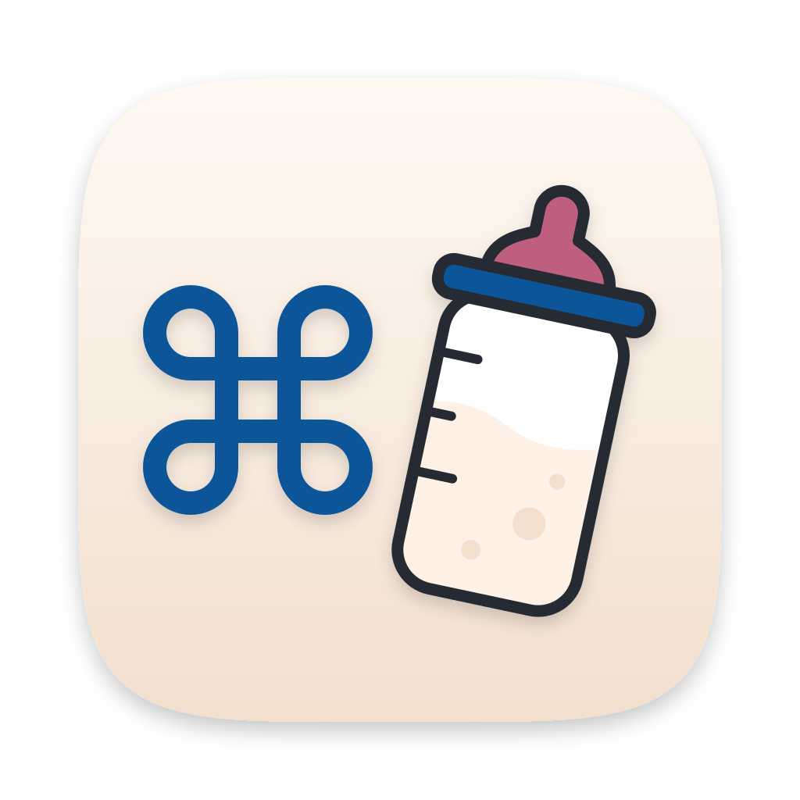
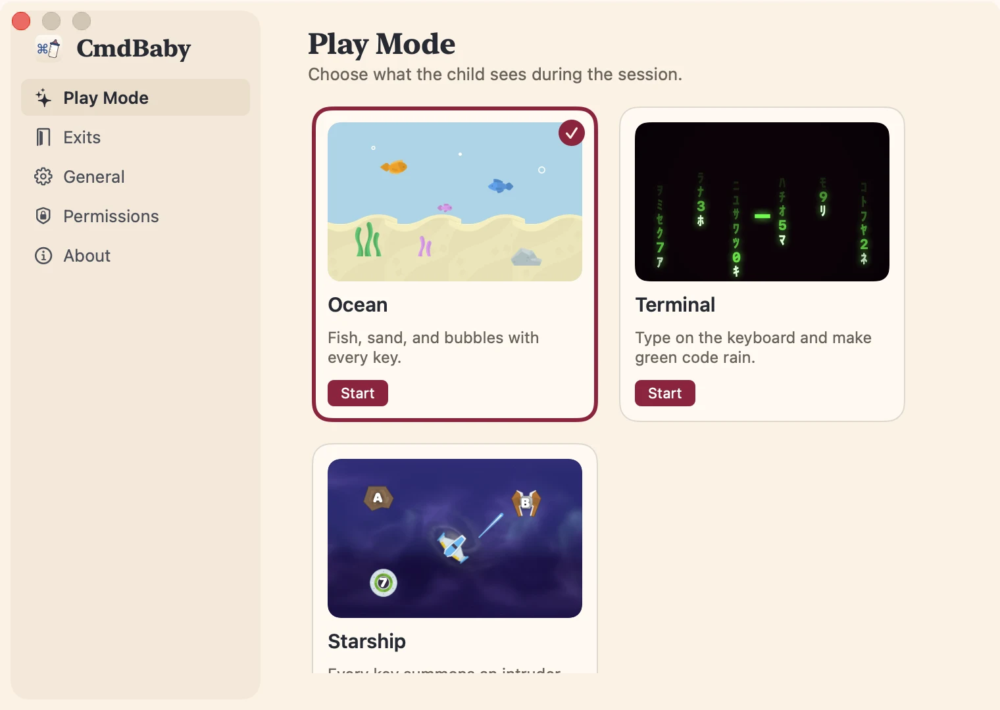

<p align="center">
  <picture>
    <source media="(prefers-color-scheme: dark)" srcset="docs/assets/brand/app-icon-1024-dark.png">
    
  </picture>
</p>

<h1 align="center">CmdBaby</h1>

<p align="center">Let your toddler bash the keyboard. Your Mac stays safe.</p>

<p align="center">
  <a href="https://cmdbaby.app">cmdbaby.app</a> ·
  <a href="https://cmdbaby.app/download">Download</a> ·
  <a href="https://github.com/camille-hdl/cmdbaby/actions/workflows/ci.yml"></a>
</p>

I built CmdBaby so my kid could play with the Mac without opening Spotlight, switching Spaces or quitting my apps. It is a small personal project, free, with no account and no tracking.

Made by [Camille](https://camillehdl.dev). Every line of code in this repo was written by an AI coding agent, under my direction.

<picture>
  <source media="(prefers-color-scheme: dark)" srcset="site/public/img/screenshots/mode-dark-en.webp">
  
</picture>

## What it does

- **Three play modes.** Ocean: fish swim in and bubbles rise with each key. Terminal: green code rains down the screen. Starship: a ship fires at the letter that was just typed.
- **Every screen covered.** A session covers every connected display. Plug in a second screen and it is covered within a second.
- **Shortcuts blocked.** During a session, Cmd and Ctrl shortcuts, function keys, media keys and the Globe key do nothing. CmdBaby never records what is typed.
- **Lives in the menu bar.** Start a session or open Settings from the bottle icon. Settings choose the play mode, the exits, the timer and the language (English or French).

## Install

Download the DMG from [cmdbaby.app](https://cmdbaby.app/download), open it and drag CmdBaby to Applications. Or use Homebrew:

```sh
brew install --cask camille-hdl/tap/cmdbaby
```

CmdBaby needs macOS 13 or later and runs on Apple Silicon and Intel. It updates itself (Sparkle) and never installs an update during a session.

## First launch

CmdBaby opens its Settings on the Exits section, so you choose how a session ends before the first one starts.

To block shortcuts, CmdBaby needs the Accessibility permission. macOS asks for it the first time you start a session. Settings, Permissions shows whether it is granted and opens the right pane of System Settings. macOS ties the permission to where the app lives, so keep CmdBaby in Applications.

## Ending a session

- Type `parent`, then Return.
- Hold Shift-Escape for 1.5 seconds.
- Click the small square in the bottom right corner 5 times.
- Or let the timer end the session, after 3 minutes by default.

Each exit can be turned on or off in Settings. The default phrase `parent` is written here and on the website, so change it in Settings, Exits.

## Privacy

CmdBaby never records, stores or sends a keystroke. Its only network access is the update check, which reads [cmdbaby.app/appcast.xml](https://cmdbaby.app/appcast.xml). Details on the [privacy page](https://cmdbaby.app/privacy/).

## Security

Report a vulnerability privately, as described in [SECURITY.md](SECURITY.md).

To check a download, run:

```sh
spctl -a -vv /Applications/CmdBaby.app
```

It should print `source=Notarized Developer ID` and `origin=Developer ID Application: CAMILLE PAULIN HODOUL (2B8R2FVJP6)`. More in [docs/securite.md](docs/securite.md#6-vérifier-un-téléchargement) (in French).

## Credits and license

The code is under the [MIT License](LICENSE). The CmdBaby name, icon and logo are not: forks must use their own.

- Game art by [Kenney](https://www.kenney.nl), CC0: Fish Pack 2.0, Space Shooter Remastered, Alien UFO Pack and Skyboxes Space.
- The bottle in the icon is an original drawing, based on a public domain (CC0) baby bottle from OpenClipart.

## Development

Requirements: macOS 13 or later, Swift 6.1 or later (Xcode 26 to build the icon).

```sh
swift test
```

Build a signed app in `/Applications`. Use your Apple Development identity so the Accessibility permission survives rebuilds:

```sh
CMDBABY_CODE_SIGN_IDENTITY="$(security find-identity -v -p codesigning | sed -n 's/.*"\(Apple Development:.*\)".*/\1/p' | head -1)" ./scripts/build-app.sh
open /Applications/CmdBaby.app
```

Without an identity, the script signs ad hoc: macOS then sees a new app after every rebuild and asks for Accessibility again.

Once per clone, enable the pre-commit hook, which refuses keys, certificates and release files:

```sh
git config core.hooksPath scripts/git-hooks
```

### Release

Set up the signing and notarization credentials once with `scripts/setup-release.sh`. Then `scripts/release.sh X.Y.Z` builds `dist/CmdBaby-X.Y.Z.dmg`, signed with Developer ID, notarized and stapled, and a signed `dist/appcast.xml`. `scripts/publish.sh X.Y.Z` puts them online: GitHub Release, appcast and download link on cmdbaby.app. Release notes go in `release-notes/X.Y.Z.md`. Test versions are `0.0.x`, published with `--prerelease`. A published version number is never reused, because releases are immutable.

### Website

The site lives in `site/` and runs on Cloudflare Workers. Preview it with `npm run --prefix site dev`. Deploy with `scripts/deploy-site.sh`. First setup: `scripts/setup-site.sh`. Regenerate the Settings screenshots with `scripts/site-screenshots.sh`.
